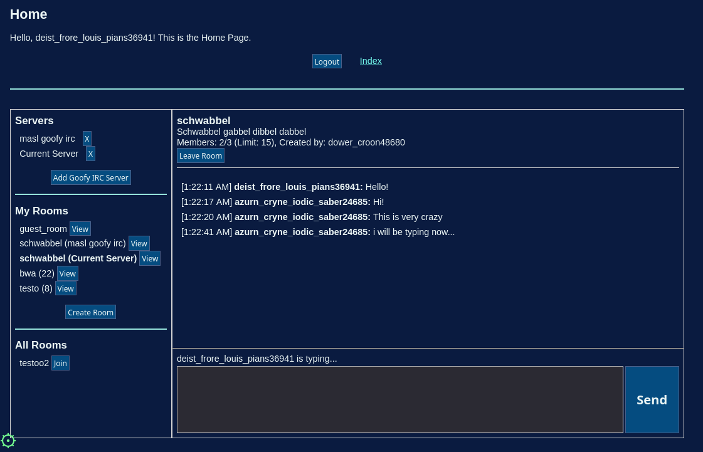

# Goofy IRC (Goofy Protocol Example Service)

This is a (WIP) Example of a Service using the [Goofy Protocol](https://github.com/marceldobehere/goofy-protocol).
It is mostly meant as a Showcase/Guide/Reference for how to create Services for the Goofy Protocol.

In the Goofy IRC you can create Chat Rooms and write in real-time with people, similar to an IRC.

## Structure
This repo contains a static [NextJS Frontend](./goofy-irc-fe/) and a [Java Backend](./goofy-irc-be/).

It is currently hosted here: https://fe.goofy-irc.rocc.systems 

If you want to try it out, please read [this section](#how-can-i-try-it)!

## Features
* Registering
  * Registering using Register Code & Automatic Registering from supported FIS Domains!
  * No need for Emails, Phone numbers or other personal verification, only a link to your FIS Instance
* Chat Rooms
  * View all Chatrooms you are part of and that are available
  * Create & Delete Rooms 
  * Join & Leave Rooms
  * Room Passwords
  * Member Management (Kick & Ban)
  * Update Room Data
* Live WebSocket Message Exchange
  * Verifiable Message Signatures
  * Support for sending Media (Images, Videos, Files, etc.) **(TODO)**
  * Keep track of all Rooms while online & temporarily store Messages
  * Chat Room messages do not persist
  * Chat Room Messages are not encrypted!
* Live Updates
  * Get live updates when the Rooms Change, Members Join/Leave, etc.
  * See when people are currently typing Messages in your room
* Friend System **(TODO)**
  * Send Friend Requests to other Members
  * Manage Received Friend Requests (Accept, Deny)
* Direct Messages **(TODO)**
  * DMs are E2E encrypted! (Very basic, no forward secrecy, etc.)
  * Media sent in DMs will be encrypted **(TODO)**
  * DMs are persistent
* Federation
  * Support for connecting to multiple IRC Servers (as a Guest)
  * Option to allow Guests to participate in Rooms
  * Friend Requests & DMs can be sent cross IRC Servers **(TODO)**
  * "Link" your IRC Server URL/Instance on your public FIS Entry **(TODO)**
  * Easy to self-host your own IRC Instance using Docker have functional federation!
* Persistence & Sync
  * Friend Requests, Server Lists, DMs, etc. are stored on the Users FIS
    * Since it's stored on the FIS, the data is basically synced between all Clients of a User
  * The IRC Server can store received Friend Requests & DMs while the User is offline! **(TODO)**
* Taking advantage of the Goofy Protocol
  * Authentication & Federation built-in
  * Service and FIS Instances can be fully decentralized
  * Minimal Storage needs for Services
    * Server doesn't need to store DMs, Pending Messages, Media Elements / Files!
  * Users have full Sovereignty over their data!
  * Automatic globally unique UserIDs/Handles
  * Automatic Support for E2E Symmetric & Asymmetric Encryption

## Screenshots

(Yes I know the UI is meh right now, it's still majorly WIP)

## How can I try it?
To try the currently deployed Goofy IRC out, you will need to be registered on a [FIS](https://github.com/marceldobehere/goofy-protocol-fis) Instance. If you aren't yet or don't know what a `FIS` is, you should look into it first! (If you want to test it locally, you can set the FIS and IRC Service up locally and run it that way)

Once you have a FIS account, you can go to your `Identity Storage` and Create a new Identity (or use an existing one) to use for the Goofy IRC instance! You will need to Export your Keypair.

Now you can go to the Frontend/Client [here](https://fe.goofy-irc.rocc.systems).
Depending on where you registered your FIS user at, you may or may not need a Register Code from me to register. 

If you need one, feel free to contact me [here](https://rocc.systems/contact/). You can also Request a Register Code in the Client. (Currently I haven't implemented Notifications so I don't really see it lol) 

You can then just import your (Service) Identity Keypair from the FIS (The one exported earlier) (+ the Register Code if needed) and register.

Once registered, you can go to the Home Page and start exploring!

## Notes
You should never trust strangers Goofy Protocol FIS or Service Clients and always verify the code first, or host the frontend yourself / run it locally! Do not give untrusted services keypairs that have important data linked to them!

The frontend currently temporarily stores your keypair in localStorage, I will add support for storing it encrypted at rest at a later point. (For now you can choose to store it in Session Storage or use it in a safe environment / don't do sensitive stuff)

## Resources
* [Goofy Protocol](https://github.com/marceldobehere/goofy-protocol) (WIP/TODO, Very messy)
* [Goofy Protocol FIS](https://github.com/marceldobehere/goofy-protocol-fis)

